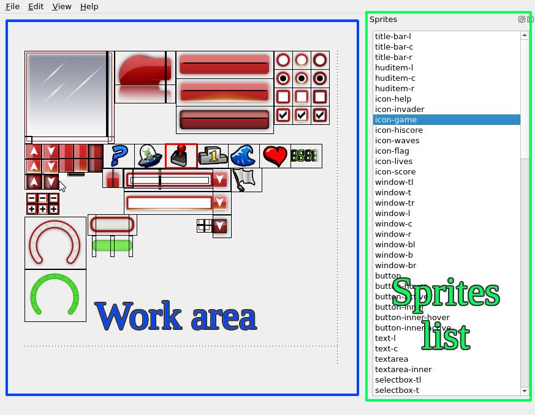

# RCSS Spritesheet Editor Manual

This document will give you an overview of the avilable functionality in the program.

## Work area

The work area is the central area of the program and contains the most functionality.

### Creating a new sprite (LEFT CLICK)

1. Left-click on the image to mark the start position of the sprite,
2. Left-click on the image to mark the end position of the sprite,
3. Enter a name for the newly created sprite.

TIP: Right-click anywhere on the image to cancel.

### Modifying an existing sprite (RIGHT CLICK)

Right-click on any existing sprite to open the context menu.

If there are multiple overlapping sprites then the "selection" context menu will
be presented to you. Select the sprite you wish to edit using it and the
"edit" context menu will open.

The currently selected sprite will be indicated by the red outline.

**Altering coordinates**

1. Select "Edit" from the context menu,
2. Alter the coordinates or width and height in the displayed window.

TIP: It is possible to increment or decrement any of the numeric fields 
using the mouse wheel.

TIP: The selected sprite will update in real-time in the main window 
work area.

**Redrawing the sprite**

1. Select "Redraw" from the context menu,
2. Left-click on the image to mark the start position of the sprite,
3. Left-click on the image to mark the end position of the sprite,

TIP: Right-click anywhere on the image and select the cancel option 
to cancel the redrawing operation.

**Deleting the sprite**

1. Select "Delete" from the context menu,

## Sprites list

The sprites list displays a list of all the sprites on the spritesheet.

Left-click on any of the list entries to highlight it on the work area.

Right-click on any of the list entries to open the "edit" context menu.

## Menu

TODO. Most actions should be pretty self-explanatory.

