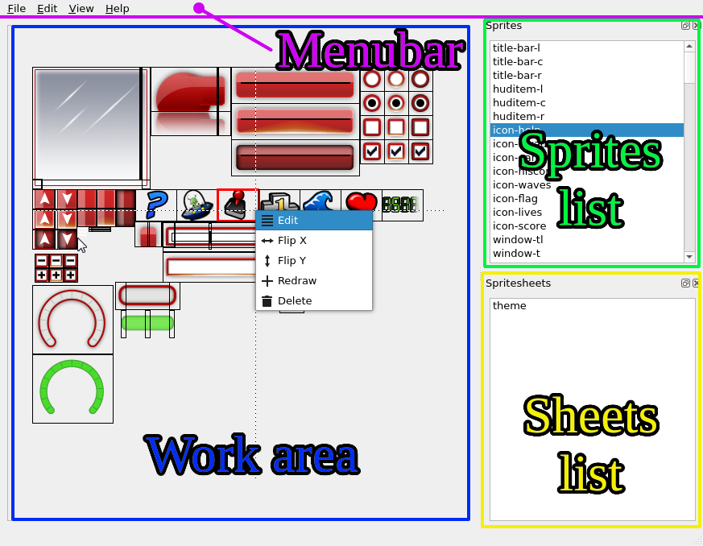
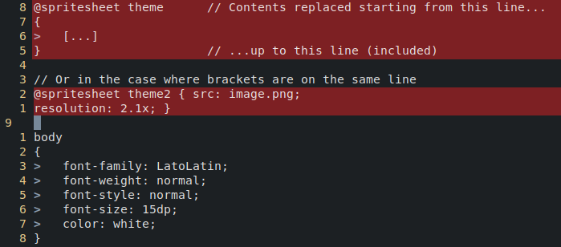
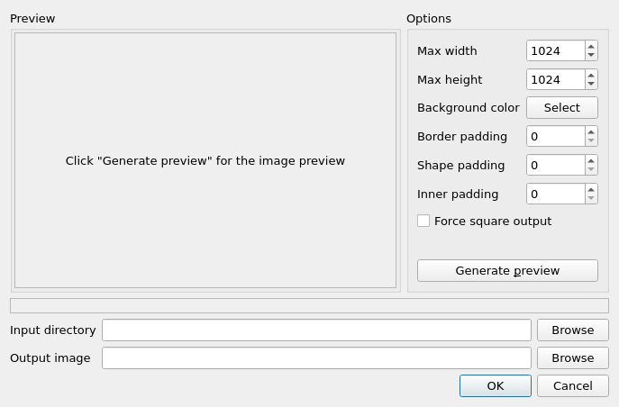

# RCSS Spritesheet Editor Manual

This document will give you an overview of the avilable functionality in the program.

## Supported image formats

The program uses Qt for image loading and saving, thus the supported file
formats depend on what (if any) Qt plugins you have installed.

If you wish to work with additional image formats then KDE's `kimageformats` package
may be of use.

Without any additional plugins Qt has support for [^1]:

* BMP (R/W)
* GIF (R)
* JPEG (R/W)
* PNG (R/W)
* PBM (R)
* PGM (R)
* PPM (R/W)
* XBM (R/W)
* XPM (R/W)

[^1]: Qt documentation lists different supported image formats on different pages, this list may not be exhaustive :)

## Notice for saving files

As of version 1.0 the program supports saving into files.
Saving works by replacing the line range in which the spritesheets are found.

What this means for you, is that the lines containing spritesheet info should
not contain any other data, because it will be overwritten.
See the image below, all blocks marked with red will be overwritten.

There are a couple of limitations in the 1.0 implementation of saving:

* In the case of multiple spritesheets, they will all be saved in the first location,
* Modifying the file outside of the program will cause the lines to become mismatched,
    and thus create corrupted files,
* No support for other data on the lines containing spritesheet data.

## Work area

The work area is the central area of the program and contains the most functionality.

### Creating a new sprite (LEFT CLICK)

1. Left-click on the image to mark the start position of the sprite,
2. Left-click on the image to mark the end position of the sprite,
3. Enter a name for the newly created sprite.

TIP: Right-click anywhere on the image to cancel.

### Modifying an existing sprite (RIGHT CLICK)

Right-click on any existing sprite to open the context menu.

If there are multiple overlapping sprites then the "selection" context menu will
be presented to you. Select the sprite you wish to edit using it and the
"edit" context menu will open.

The currently selected sprite will be indicated by the red outline.

**Altering coordinates**

1. Select "Edit" from the context menu,
2. Alter the coordinates or width and height in the displayed window.

TIP: It is possible to increment or decrement any of the numeric fields 
using the mouse wheel.

TIP: The selected sprite will update in real-time in the main window 
work area.

**Redrawing the sprite**

1. Select "Redraw" from the context menu,
2. Left-click on the image to mark the start position of the sprite,
3. Left-click on the image to mark the end position of the sprite,

TIP: Right-click anywhere on the image and select the cancel option 
to cancel the redrawing operation.

**Deleting the sprite**

1. Select "Delete" from the context menu,

## Sprites list

The sprites list displays a list of all the sprites on the spritesheet.

Left-click on any of the list entries to highlight it on the work area.

Right-click on any of the list entries to open the "edit" context menu.

## Spritesheets list

Left-click on any of the list entries to select a spritesheet.

## Sprite packer

The sprite packer tool allows you to pack loose image files into a
single spritesheet.

The tool will recurse the directories starting from the one input into
`Input directory` box.

For information about the tool `Options` view the tooltips for each
item by hovering above the edit box with the mouse cursor.

The image will be saved into `Output image` upon clicking `OK`.
Clicking `Generate preview` does not store the image on disk
and is meant for fine-tuning the packing options.

A limitation in 1.0 is that all files contained in the directories 
will be assumed to be images.

The image filenames will be used to generate the sprite names.
The `Input directory` name and the image file extension will not
be included in the generated sprite names.
The sprite name will be prefixed with it's top directories,
with a dash (`-`) in between.

As an example:
Having entered `Input directory` as `./pack` the tool encounters
the file `./pack/button/hover.png`, in which case the generated
sprite id will become `button-hover`.

## Menubar

TODO. Most actions should be pretty self-explanatory.

**Replacing the source image**

It can be useful to replace the source image while keeping the same sprites
 in-memory.  For that there is the menu option "Set image", using which you
 can use another background image.

Combined with the "Redraw" feature, this can be an useful tool for transferring
sprites onto a new, differently positioned, spritesheet.

NOTE: The program allows the user to load sprites from any directory in
 the filesystem, but only the filename will be written into the RCSS file.
