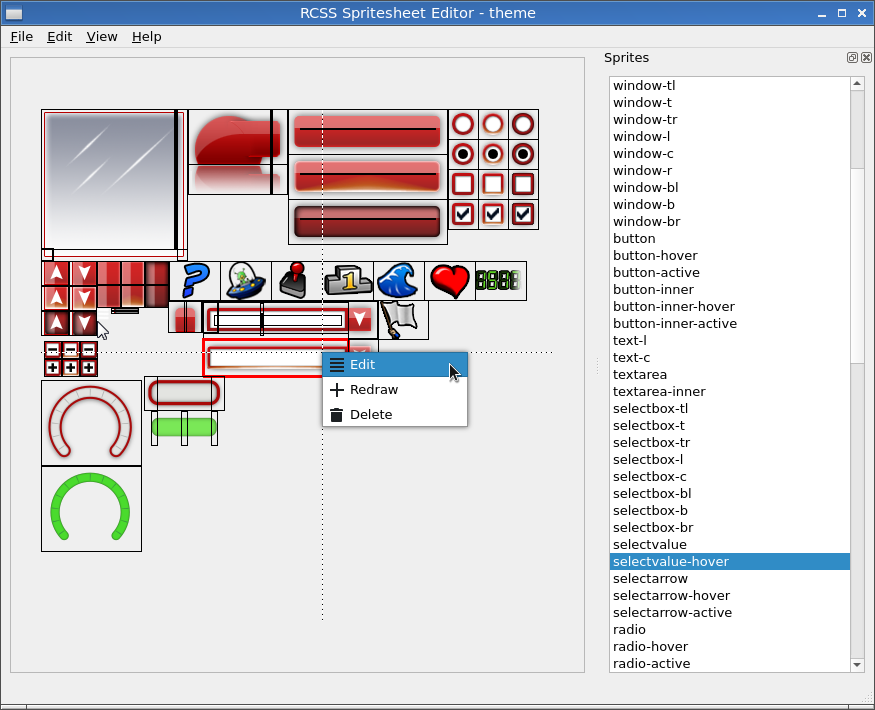

# RCSS Spritesheet Editor

A little editor for spritesheets contained in 
[RmlUi](https://github.com/mikke89/RmlUi) stylesheets.
Requires Python and Qt5.

Features:

* Create new sprites (mouse drawing),
* Pack images from folders into RCSS spritesheets,
* Delete sprites,
* Modify existing sprites (redraw using mouse or enter values),
* Replace source image (spritesheet `src` attribute),
* Undo/redo.



If you encounter any bugs then please create an 
[issue](https://github.com/svenvvv/rcss-sprite-ed/issues).

## Documentation

See [the manual](./MANUAL.md)

## Setting up

Install the requirements.

```
pip3 install -r requirements.txt
```

Run the program.

```
./main.py
# or python3 main.py
```

## TODO

* Doesn't support saving into RCSS files.

Presently, when you click save, then the program will present you with text
which you can manually paste into your stylesheet.

* No support for creating new spritesheets.

It's required to provide an existing one from an RCSS file.

* Bugs, probably.

Haven't had a chance to work on my UI, as I was writing this tool instead :).

